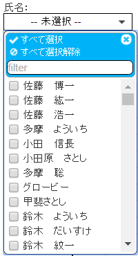

# MultiSelectFilter
This plug-in is the MIT license.

Jquery library is required.

`<select id="select-name" name="select-name[]" multiple>`  
The id and name attributes are required.

`$('#select-name').MultiSelectFilter('init',`  
`　　{delay: 300,`  
`　　Width: 150,`  
`　　textlen: 3,`  
`　　selected: '個選択',`  
`　　defalult: '-- 未選択 --',`  
`　　check_all: 'すべて選択',`  
`　　uncheck_all: 'すべて選択解除',`  
`　　filter: true}`  
`);`  
